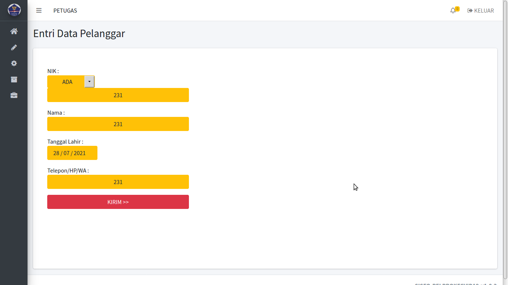

# sisfo-pelprokesvid19

SISFO-PELPROKESVID19 v1.0 : Sistem Informasi Pendataan Pelanggar ProKes Covid-19,  

agar bisa diketahui posisi pelanggar/warga ada dimana saja, dan bisa diketahui jumlah rangking pelanggarnya. Serta rincian pelanggarannya. Cocok digunakan untuk SatPol PP maupun Satgas Covid-19, saat melakukan operasi prokes di lapangan. 

Dibuat dan dites dengan WebServer XAMPP PHP 7.4 . Pada LinuxMint.

---

FITUR :

- Data Master Kecamatan.

- Data Master Denda.

- Data Master Petugas/BAP.

- Data Master Ketua.

- Deteksi GPS Browser untuk akses user Petugas dan akses user B.A.P

- History Per Pelanggaran

- History Per Peringkat Pelanggar/Warga

- History Per Login Petugas/BAP

- History Per Entri Pelanggaran

- History Per GPS Lokasi Petugas/BAP

- Laporan Rekap Per Kecamatan

- Laporan Rekap Per Pelanggar

- Laporan Rekap Per BAP Pelanggaran

- Laporan Rekap Per Bulan

- Laporan Rekap Per Tanggal

---

TAMPILAN / SKRINSUT :  

 

 

 

 

 

 

 

 

 

 

 

 

 

 

---

INSTALASI DAN KONFIGURASI :  

1. Ekstrak file web ke folder web webserver www atau htdocs

2. Untuk konfigurasi, bisa set di file /inc/config.php

3. Jalankan phpmyadmin, buatlah sebuah database. dan lakukan import file database .sql, ada di folder /db

4. Jalankan sesuai alamat web yang ada.

---

CONTOH AKSES USER ADMIN :

User : admin  

Pass : admin

---

CONTOH AKSES USER PETUGAS :

User : 1

Pass : 1

---

CONTOH AKSES USER B.A.P :

User : 1

Pass : 1

---

CONTOH AKSES USER KETUA :

User : 4

Pass : 4

---

NB. 

DEMO ONLINE atau ingin request custom konten berbayar, silahkan bisa hubungi : 

hp/sms/wa : 081-829-88-54 

atau email : hajirodeon@gmail.com

